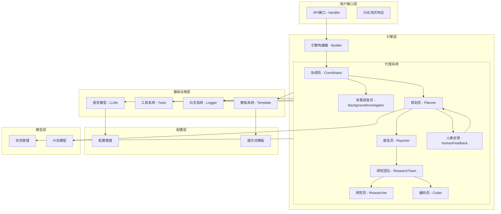
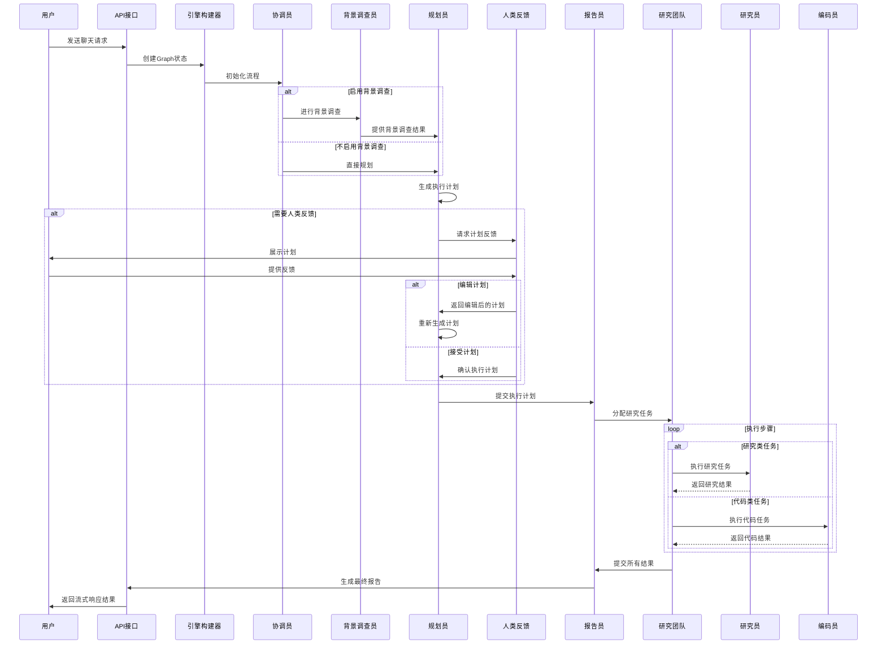

# EinoDeer 项目

## 项目简介

EinoDeer 是一个基于 Golang 开发的智能代理系统，它利用大语言模型（LLM）和工具调用能力，实现了一个可以执行各种任务的智能助手。项目主要特点包括：

- 基于 Eino 框架构建的智能代理系统
- 支持浏览器搜索和网页爬虫功能
- 提供代码生成和数据分析能力
- 支持流式响应的聊天接口

## 系统架构

项目主要由以下几个部分组成：

1. **引擎层（engine）**：包含各种角色代理，如研究员、编码员、协调员等
2. **基础设施层（infra）**：提供工具调用、LLM 接口、日志等基础功能
3. **配置层（config）**：管理系统配置信息
4. **提示词（prompts）**：为不同角色代理提供指导提示
5. **API 接口（handler）**：提供 HTTP 接口服务

### 架构设计图



### 交互时序图



### 代码结构与时序图对应关系

以下是代码结构与时序图的对应关系，帮助理解系统的实现方式：

#### 1. 用户请求处理流程

```
User->>API: 发送聊天请求
API->>Builder: 创建Graph状态
Builder->>Coordinator: 初始化流程
```

**对应代码实现：**

- **API处理**：`handler/deer.go` 中的 `ChatStreamEino` 函数接收用户请求
  ```go
  func ChatStreamEino(ctx *gin.Context) {
      // 请求体校验
      req := new(model.ChatRequest)
      if err := ctx.ShouldBind(&req); err != nil {
          // 错误处理
      }
      
      // 根据前端参数生成Graph State
      genFunc := func(ctx context.Context) *model.State {
          return &model.State{
              MaxPlanIterations:             req.MaxPlanIterations,
              MaxStepNum:                    req.MaxStepNum,
              Messages:                      req.Messages,
              Goto:                          constants.AgentCoordinator,
              EnableBackgroundInvestigation: req.EnableBackgroundInvestigation,
          }
      }
      
      // Build Graph
      r := engine.Builder[string, string, *model.State](ctx, genFunc)
      
      // Run Graph
      _, err := r.Stream(ctx, constants.AgentCoordinator, ...)
  }
  ```

- **Graph构建**：`engine/builder.go` 中的 `Builder` 函数创建并连接各个代理节点
  ```go
  func Builder[I, O, S any](ctx context.Context, genFunc compose.GenLocalState[S]) compose.Runnable[I, O] {
      g := compose.NewGraph[I, O](...)
      
      // 添加各个代理节点
      coordinatorGraph := NewCAgent[I, O](ctx)
      plannerGraph := NewPlanner[I, O](ctx)
      // 其他代理节点...
      
      // 添加节点到图中
      _ = g.AddGraphNode(constants.AgentCoordinator, coordinatorGraph, ...)
      // 其他节点...
      
      // 添加分支和边
      _ = g.AddBranch(constants.AgentCoordinator, compose.NewGraphBranch(agentHandOff, outMap))
      // 其他分支...
      
      // 编译图
      r, err := g.Compile(ctx, ...)
      return r
  }
  ```

#### 2. 背景调查与规划流程

```
alt 启用背景调查
    Coordinator->>Investigator: 进行背景调查
    Investigator->>Planner: 提供背景调查结果
else 不启用背景调查
    Coordinator->>Planner: 直接规划
end
```

**对应代码实现：**

- **协调员决策**：`engine/coordinator.go` 中的 `router` 函数决定流程走向
  ```go
  func router(ctx context.Context, input *schema.Message, opts ...any) (output string, err error) {
      err = compose.ProcessState[*model.State](ctx, func(_ context.Context, state *model.State) error {
          // ...
          if state.EnableBackgroundInvestigation {
              state.Goto = constants.AgentBackgroundInvestigator
          } else {
              state.Goto = constants.AgentPlanner
          }
          return nil
      })
      return output, nil
  }
  ```

- **规划器处理**：`engine/planner.go` 中的 `loadPlannerMsg` 函数处理背景调查结果
  ```go
  func loadPlannerMsg(ctx context.Context, name string, opts ...any) (output []*schema.Message, err error) {
      err = compose.ProcessState[*model.State](ctx, func(_ context.Context, state *model.State) error {
          // ...
          if state.EnableBackgroundInvestigation && len(state.BackgroundInvestigationResults) > 0 {
              promptTemp = prompt.FromMessages(schema.Jinja2,
                  // 包含背景调查结果的提示
              )
          } else {
              promptTemp = prompt.FromMessages(schema.Jinja2,
                  // 不包含背景调查结果的提示
              )
          }
          // ...
      })
      return output, err
  }
  ```

#### 3. 人类反馈流程

```
alt 需要人类反馈
    Planner->>Human: 请求计划反馈
    Human->>User: 展示计划
    User->>Human: 提供反馈
    alt 编辑计划
        Human->>Planner: 返回编辑后的计划
        Planner->>Planner: 重新生成计划
    else 接受计划
        Human->>Planner: 确认执行计划
    end
end
```

**对应代码实现：**

- **规划器决策**：`engine/planner.go` 中的 `routerPlanner` 函数决定是否需要人类反馈
  ```go
  func routerPlanner(ctx context.Context, input *schema.Message, opts ...any) (output string, err error) {
      err = compose.ProcessState[*model.State](ctx, func(_ context.Context, state *model.State) error {
          // ...
          if state.CurrentPlan.HasEnoughContext {
              state.Goto = constants.AgentReporter
              return nil
          }
          
          state.Goto = constants.AgentHuman // 需要人类反馈
          return nil
      })
      return output, nil
  }
  ```

- **中断处理**：`handler/deer.go` 中处理中断信号并向前端发送选项
  ```go
  // 将interrupt信号传递到前端
  if info, ok := compose.ExtractInterruptInfo(err); ok {
      // ...
      data := &model.ChatResp{
          // ...
          Options: []map[string]any{
              {
                  "text":  "编辑计划",
                  "value": "edit_plan",
              },
              {
                  "text":  "开始执行",
                  "value": "accepted",
              },
          },
      }
      // ...
  }
  ```

#### 4. 任务执行流程

```
Planner->>Reporter: 提交执行计划
Reporter->>ResearchTeam: 分配研究任务

loop 执行步骤
    alt 研究类任务
        ResearchTeam->>Researcher: 执行研究任务
        Researcher-->>ResearchTeam: 返回研究结果
    else 代码类任务
        ResearchTeam->>Coder: 执行代码任务
        Coder-->>ResearchTeam: 返回代码结果
    end
end
```

**对应代码实现：**

- **任务分配**：通过 `engine/builder.go` 中的 `agentHandOff` 函数实现代理之间的任务传递
  ```go
  func agentHandOff(ctx context.Context, input string) (next string, err error) {
      // ...
      _ = compose.ProcessState[*model.State](ctx, func(_ context.Context, state *model.State) error {
          next = state.Goto
          return nil
      })
      return next, nil
  }
  ```

- **步骤执行**：各个代理（如 `engine/researcher.go`、`engine/coder.go` 等）实现具体任务

- **状态管理**：`model/state.go` 中的 `State` 结构体管理整个执行过程的状态
  ```go
  type State struct {
      // 用户输入的信息
      Messages []*schema.Message `json:"messages,omitempty"`
  
      // 子图共享变量
      Goto                           string `json:"goto,omitempty"`
      CurrentPlan                    *Plan  `json:"current_plan,omitempty"`
      // ...
  
      // 全局配置变量
      MaxPlanIterations             int  `json:"max_plan_iterations,omitempty"`
      MaxStepNum                    int  `json:"max_step_num,omitempty"`
      // ...
  }
  ```

#### 5. 结果报告流程

```
ResearchTeam->>Reporter: 提交所有结果
Reporter->>API: 生成最终报告
API->>User: 返回流式响应结果
```

**对应代码实现：**

- **结果收集**：各代理将结果写入共享状态

- **流式响应**：`infra/sse.go` 实现了服务器发送事件（SSE）功能，用于流式返回结果
  ```go
  func WriteSSE(w http.ResponseWriter, id, event string, data []byte) error {
      // 实现SSE写入逻辑
  }
  ```

- **回调处理**：`handler/deer.go` 中通过回调函数处理流式输出
  ```go
  // Run Graph
  _, err := r.Stream(ctx, constants.AgentCoordinator,
      // ...
      // 连接LoggerCallback
      compose.WithCallbacks(&infra.LoggerCallback{
          ID:  req.ThreadID,
          SSE: ctx.Writer,
      }),
  )
  ```

## 项目目录结构

项目采用模块化设计，各个目录职责明确，便于维护和扩展：

```
├── README.md               # 项目说明文档
├── config/                 # 配置相关
│   ├── config.go           # 配置加载和管理
│   └── config.yaml         # 配置文件
├── constants/              # 常量定义
│   └── constant.go         # 系统常量，如代理角色名称等
├── engine/                 # 引擎核心组件
│   ├── builder.go          # 引擎构建器
│   ├── coder.go            # 编码员代理
│   ├── coordinator.go      # 协调员代理
│   ├── human_feedback.go   # 人类反馈处理
│   ├── investigator.go     # 背景调查员代理
│   ├── planner.go          # 规划员代理
│   ├── reporter.go         # 报告员代理
│   ├── research_team.go    # 研究团队代理
│   └── researcher.go       # 研究员代理
├── handler/                # API处理器
│   └── deer.go             # 聊天接口处理
├── infra/                  # 基础设施
│   ├── llms.go             # 语言模型接口
│   ├── logger.go           # 日志系统
│   ├── sse.go              # 服务器发送事件(SSE)实现
│   ├── template.go         # 模板处理
│   └── tools.go            # 工具系统
├── main.go                 # 程序入口
├── model/                  # 数据模型
│   ├── planer.go           # 计划相关模型
│   ├── server_model.go     # 服务器模型
│   ├── state.go            # 状态管理
│   └── state_test.go       # 状态测试
├── prompts/                # 提示词模板
│   ├── coder.md            # 编码员提示词
│   ├── coordinator.md      # 协调员提示词
│   ├── planner.md          # 规划员提示词
│   ├── podcast_script_writer.md # 播客脚本编写提示词
│   ├── ppt_composer.md     # PPT编写提示词
│   ├── reporter.md         # 报告员提示词
│   └── researcher.md       # 研究员提示词
└── utils/                  # 工具函数
    └── util.go             # 通用工具函数
```

### 目录职责说明

- **config/**：负责系统配置的加载和管理，包含配置文件和配置处理逻辑
- **constants/**：定义系统中使用的常量，如代理角色名称、状态码等
- **engine/**：系统核心引擎，包含各种代理角色的实现和引擎构建逻辑
- **handler/**：API接口处理层，负责接收和响应HTTP请求
- **infra/**：基础设施层，提供语言模型调用、日志、SSE、工具等基础功能
- **model/**：数据模型定义，包含状态管理、计划模型等核心数据结构
- **prompts/**：各种角色的提示词模板，指导LLM生成符合要求的内容
- **utils/**：通用工具函数，提供各种辅助功能

## 功能特点

- **浏览器搜索**：模拟网络搜索功能，获取相关信息
- **网页爬虫**：模拟网页内容爬取，提取页面信息
- **代码生成**：根据需求生成 Golang 代码示例
- **数据分析**：提供数据分析相关的代码生成能力
- **流式响应**：支持流式输出的聊天接口

## 运行环境要求

- Go 1.20 或更高版本
- 支持 macOS、Linux 和 Windows 系统

## 安装与运行

### 1. 克隆项目

```bash
git clone <项目仓库地址>
cd einodeer
```

### 2. 安装依赖

```bash
go mod download
```

### 3. 配置设置

编辑 `config/config.yaml` 文件，根据需要修改配置：

```yaml
tools:
  servers:
    browser_search:
      api_key: "<搜索API密钥>"
    web_crawler:
      api_key: "<爬虫API密钥>"

model:
  default_model: "<默认模型名称>"
  api_key: "<API密钥>"
  base_url: "<API基础URL>"

setting:
  max_plan_iterations: 3
  max_step_num: 10
```

### 4. 运行服务

```bash
go run main.go
```

服务将在 http://localhost:8888 启动

## API 使用

### 聊天接口

```
POST /api/chat/stream
```

请求示例：

```json
{
  "messages": [
    {
      "role": "user",
      "content": "帮我搜索关于人工智能的最新进展"
    }
  ]
}
```

响应为 Server-Sent Events (SSE) 格式的流式数据。

## 开发与扩展

### 添加新工具

1. 在 `infra/tools.go` 中实现新的工具类型
2. 在 `config/config.yaml` 中添加相应配置

### 添加新角色

1. 在 `prompts/` 目录下添加新角色的提示词
2. 在 `engine/` 目录下实现新角色的逻辑

## 许可证

[项目许可证信息]